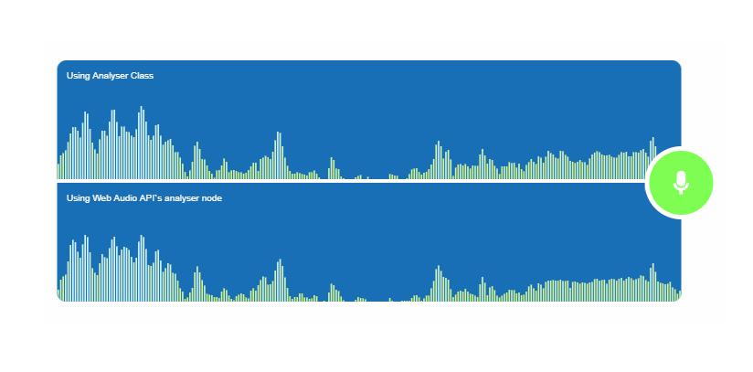

# AnalyserJS
AnalyserJS is audio analyser based on [Web Audio API Documentation](https://www.w3.org/TR/webaudio/#analysernode) wirten in JS

### Audio Analyser class
Class that implements the [AnalyserNode](https://www.w3.org/TR/webaudio/#analysernode), it
uses raw audio data given directly from the microphone or audio file and converts a signal from its original time domain to a representation in the frequency domain using [fast Fourier transform (FFT)]( https://en.wikipedia.org/wiki/Fast_Fourier_transform)

 
